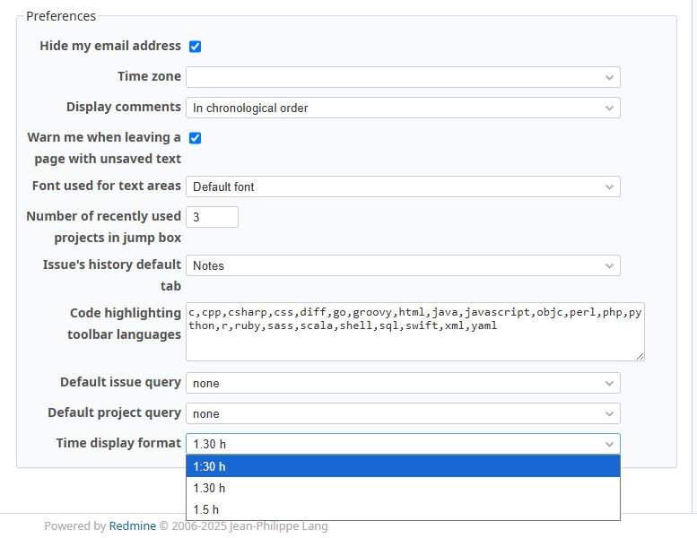
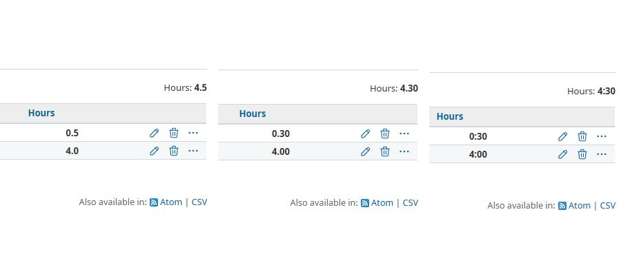

# RedmineTimeSpentHumanReadable

RedmineTimeSpentHumanReadable is a simple plugin that allows each user to choose their **preferred time display format** for spent time.

## Examples

| User-selected format | Display        |
|----------------------|----------------|
| `h:m`                | `1:30`         |
| `h.m`                | `1.5`          |
| `h_m`                | `1.30`         |

  


## Installation

1. Copy the plugin folder to: `plugins/redmine_time_spent_human_readable`

2. Run migration (if required by version):
```bash
bundle exec rake redmine:plugins:migrate RAILS_ENV=production
```

3. Restart Redmine.

## Compatibility
- Redmine 5.x
- Redmine 6.x

## User Settings
Each user can choose their own display format under:
My account -> Preferences -> Time display format

Available formats:
```
h:m (e.g. 1:30)
h.m (e.g. 1.5)
h_m (e.g. 1.30)
```
## Notes
Some Redmine UI parts automatically add "h" after the number (e.g. 1:30h).
This plugin changes only formatting, not calculation logic.

# RedmineTimeSpentHumanReadable

RedmineTimeSpentHumanReadable to prosty plugin, który pozwala użytkownikowi ustawić **preferowany format wyświetlania przepracowanego czasu**.

## Przykłady

| Wybrany format | Wyświetlanie   |
|----------------|----------------|
| `h:m`          | `1:30`         |
| `h.m`          | `1.5`          |
| `h_m`          | `1.30`         |

  


## Instalacja

1. Skopiuj folder do: `plugins/redmine_time_spent_human_readable`

2. Wykonaj migrację dodając brakujące kolumny:
```bash
bundle exec rake redmine:plugins:migrate RAILS_ENV=production
```

3. Zrestartuj Redmine.

## Kompatybilność
- Redmine 5.x
- Redmine 6.x

## Ustawienia Użytkownika
Każdy użytkownik może ustawić preferowany format wyświetlania czasu:
Moje konto → Preferencje → Format wyświetlania czasu

Dostępne formaty:
```
h:m (e.g. 1:30)
h.m (e.g. 1.5)
h_m (e.g. 1.30)
```
## Uwagi
W niektórych miejscach Redmine automatycznie dopisuje "h" po wartości czasu (np. 1:30h).
Plugin zmienia jedynie sposób formatowania, nie wpływa na logikę obliczeń.